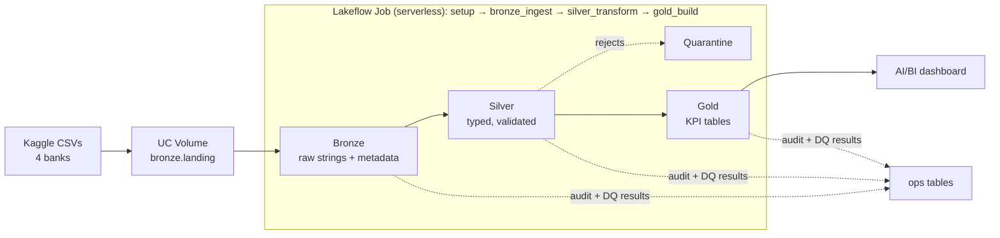

# Indonesian Bank Stocks: Databricks Medallion Pipeline and Dashboard

An end-to-end batch data-engineering project on **Databricks Free Edition**. Daily price data for four Indonesian banks (BBCA, BBNI, BMRI, BBRI)
from Kaggle flows through a **Bronze → Silver → Gold** pipeline with data-quality checks at every layer, run audit, an orchestrated Lakeflow Job,
rerun and failure/recovery tests, and an **AI/BI dashboard** whose values are reconciled against independent queries. The analysis is
**descriptive and historical, not investment advice.**

## Demo video

Video: (link to be added)

Interview-style questions and answers: [`docs/INTERVIEW_QA.md`](docs/INTERVIEW_QA.md) · glossary and lessons learned:
[`docs/LEARNINGS.md`](docs/LEARNINGS.md)

## Business questions

| ID | Question |
| -- | -------- |
| Q1 | Over the period, which stock delivered the highest total return, and how did the comparative performance path evolve? |
| Q2 | Which stock is most volatile, and how did volatility change over time (especially in 2020)? |
| Q3 | What was each stock's deepest decline from a peak, and how far is it currently below its peak? |
| Q4 | How do monthly and yearly returns compare across the four stocks? |
| Q5 | How does trading volume change over time relative to each stock's own normal level? |

KPI definitions: [`docs/KPI_DEFINITIONS.md`](docs/KPI_DEFINITIONS.md).

## Architecture



Details: [`docs/ARCHITECTURE.md`](docs/ARCHITECTURE.md) · tables and columns: [`docs/DATA_MODEL.md`](docs/DATA_MODEL.md) ·
decisions: [`docs/DECISIONS.md`](docs/DECISIONS.md).

**Tech stack:** Databricks Free Edition (serverless compute), Unity Catalog (catalog, schemas, Volumes), Delta Lake, PySpark and Spark SQL,
Lakeflow Jobs, AI/BI dashboards, Git folders; plain Python for local tests; the Kaggle CLI for the source data.

## Repository structure

```
config/pipeline.json            single configuration source (catalog, schemas, landing path, tickers, KPI parameters)
src/bank_pipeline/              transformation and helper functions (config, bronze, silver, gold, dq, audit, rerun, fixtures, reset)
notebooks/                      00_setup, 01_bronze_ingest, 02_silver_transform, 03_gold_build (the Job tasks);
                                10_landing_smoke_test, 90_make_failure_fixture, 91_rerun_check, 95_reset_environment (tools)
jobs/                           sanitized Job definition (YAML)
dashboards/                     dashboard build guide (DASHBOARD_SPEC.md) and dataset SQL (datasets/)
sql/validation/                 validation and reconciliation queries with expected results
tests/                          test_pure.py (local) and run_unit_tests.py (Databricks)
docs/                           dataset, KPIs, architecture, data model, decisions, DQ catalog, tests, runbook, limitations
docs/evidence/                  recorded run results and dashboard screenshots
```

## Key results (descriptive, not investment advice)

Snapshot: daily prices from the base date **2019-01-02** to the last trade date **2026-10-08** (source run `20261009T124332+0700`). Total
return uses `adjclose`, adjusted for dividends and corporate actions. Values are from Gold, reconciled with independent Silver queries and with the
dashboard ([`docs/evidence/d3-03-dashboard-reconciliation.md`](docs/evidence/d3-03-dashboard-reconciliation.md),
[`docs/evidence/d2-05-gold.md`](docs/evidence/d2-05-gold.md)).

| Bank | Total return | Volatility (annualized) | Max drawdown | Peak → trough |
| ---- | -----------: | ----------------------: | -----------: | ------------- |
| BBCA (Bank Central Asia) | 40.97% | 26.22% | −51.79% | 2024-09-23 → 2026-06-08 |
| BBNI (Bank Negara Indonesia) | 9.50% | 34.15% | −66.16% | 2019-04-18 → 2020-03-24 |
| BBRI (Bank Rakyat Indonesia) | 43.02% | 32.62% | −52.43% | 2020-01-23 → 2020-05-18 |
| BMRI (Bank Mandiri) | 75.97% | 33.51% | −52.05% | 2019-07-15 → 2020-05-18 |


*The AI/BI dashboard (all four banks, no filter) after the clean-state rebuild; more views in [`docs/evidence/d3-01-dashboard.md`](docs/evidence/d3-01-dashboard.md).*

## Reliability highlights

- **Data-quality checks in every layer** (Bronze 6, Silver 14, Gold 10). A failed CRITICAL check stops the task before it writes
  ([`docs/DQ_CATALOG.md`](docs/DQ_CATALOG.md)).
- **Idempotent reruns:** two Job runs on the same input give identical tables (9/9 tables compared via Delta time travel;
  [`docs/evidence/d2-07-rerun.md`](docs/evidence/d2-07-rerun.md)).
- **Induced failure and recovery:** a duplicated key stopped Silver, Gold was skipped, the failure email arrived, and a new run restored everything with
  identical KPIs ([`docs/evidence/d2-09-failure-test.md`](docs/evidence/d2-09-failure-test.md)).
- **Reconciliation:** 14/14 dashboard values match independent queries on Silver
  ([`docs/evidence/d3-03-dashboard-reconciliation.md`](docs/evidence/d3-03-dashboard-reconciliation.md)).
- **Clean-state reproduction:** after dropping all 11 pipeline tables, one Job run with default parameters rebuilt everything with identical row counts,
  KPIs and peak/trough dates, and the dashboard showed the same values ([`docs/evidence/d3-04-clean-state.md`](docs/evidence/d3-04-clean-state.md)).
- **Tests:** plain-Python and Spark unit tests with hand-computed values ([`docs/TEST_RESULTS.md`](docs/TEST_RESULTS.md)).

## Reproduce it

**Prerequisites:** a Databricks Free Edition account, a Kaggle account, and Python 3 with `pip`.

1. **Download the data** with the Kaggle CLI (create an API token in your Kaggle account settings first):

   ```bash
   pip install kaggle
   ```
   ```bash
   kaggle auth login
   ```
   ```bash
   kaggle datasets download caesarmario/bank-central-asia-stock-historical-price -p data/raw/bbca --unzip
   ```
   ```bash
   kaggle datasets download caesarmario/bank-negara-indonesia-stock-historical-price -p data/raw/bbni --unzip
   ```
   ```bash
   kaggle datasets download caesarmario/bank-mandiri-stock-historical-price -p data/raw/bmri --unzip
   ```
   ```bash
   kaggle datasets download caesarmario/bank-rakyat-indonesia-stock-historical-price -p data/raw/bbri --unzip
   ```

   Alternatively, set the `KAGGLE_API_TOKEN` environment variable instead of `kaggle auth login`. The datasets are refreshed by their publisher, so a
   newer download gives a newer snapshot and slightly different numbers than above.

2. **Create a Git folder** in your Databricks workspace (Workspace → your user folder → Create → Git folder) from this public repository's URL. No
   credentials are needed. The paths below assume the folder is named `indonesia-bank-stocks-databricks`.

3. **Run `notebooks/00_setup`**. It creates the schemas `bronze`, `silver`, `gold`, `ops`, the Volume `workspace.bronze.landing` and the `ops` tables,
   and prints `SETUP PASS`.

4. **Upload 8 files** to the Volume (Catalog Explorer → `workspace` → `bronze` → `landing`), one folder per bank:

   | Volume folder | Files |
   | ------------- | ----- |
   | `/Volumes/workspace/bronze/landing/bbca/` | `BBCA.JK.csv`, `run-summary.json` |
   | `/Volumes/workspace/bronze/landing/bbni/` | `BBNI.JK.csv`, `run-summary.json` |
   | `/Volumes/workspace/bronze/landing/bmri/` | `BMRI.JK.csv`, `run-summary.json` |
   | `/Volumes/workspace/bronze/landing/bbri/` | `BBRI.JK.csv`, `run-summary.json` |

5. **Run `notebooks/10_landing_smoke_test`**. Expected output: `SMOKE TEST PASS`.

6. **Create the Job** from [`jobs/indonesia_bank_stocks_pipeline.job.yml`](jobs/indonesia_bank_stocks_pipeline.job.yml): replace `<your-user>` and
   `<your-email>`, or create the 4 tasks in the Jobs UI with the parameters listed in [`docs/ARCHITECTURE.md`](docs/ARCHITECTURE.md). Then
   **Run now**.

7. **Create the dashboard** from [`dashboards/DASHBOARD_SPEC.md`](dashboards/DASHBOARD_SPEC.md), using the dataset SQL in `dashboards/datasets/`
   (import from an exported definition is also possible where available; see the spec, §6).

8. **Validate** in the Databricks SQL editor: run `sql/validation/01_bronze.sql`, `02_silver.sql`, `03_gold.sql` and
   `06_dashboard_reconciliation.sql`, and compare each result with the expected result stated above the query. The expected values are for the
   2026-10-08 snapshot; a newer Kaggle snapshot changes them (row counts, dates and KPIs), while the structural checks (unique keys, Silver = Gold,
   abs_diff 0) still apply.

**Clean-state rerun:** run `notebooks/95_reset_environment` with `confirm = RESET`, run the Job, then compare
`sql/validation/01`–`03` and `06` with the recorded values ([`docs/RUNBOOK.md`](docs/RUNBOOK.md)).

## Tests

- Locally: `python tests/test_pure.py` (no Spark and no data needed).
- In Databricks: run the notebook `tests/run_unit_tests`, and the queries in `sql/validation/` (each file states its expected results).

## Limitations and data source

- Known limitations: [`docs/LIMITATIONS.md`](docs/LIMITATIONS.md).
- **Data source:** Kaggle datasets by `caesarmario` (Kaggle licence label `world-bank`), which the publisher states are taken from Yahoo Finance.
  The upstream redistribution terms were not verified, so **raw data is not included in this repository**; download it with the commands above.
  Dataset details: [`docs/DATASET.md`](docs/DATASET.md).

## License

The **code** in this repository is released under the [MIT License](LICENSE). The **market data** is not included or redistributed; it remains subject to
its source's terms, which were not verified (see [`docs/DATASET.md`](docs/DATASET.md)).

The dashboard export `dashboards/indonesian_bank_stocks.lvdash.json` contains Databricks object IDs (dashboard and dataset IDs) from the original
workspace; they are not credentials, and whether an import assigns new IDs is unverified.

## Documentation

[`docs/DATASET.md`](docs/DATASET.md) · [`docs/KPI_DEFINITIONS.md`](docs/KPI_DEFINITIONS.md) · [`docs/ARCHITECTURE.md`](docs/ARCHITECTURE.md) ·
[`docs/DATA_MODEL.md`](docs/DATA_MODEL.md) · [`docs/DECISIONS.md`](docs/DECISIONS.md) · [`docs/DQ_CATALOG.md`](docs/DQ_CATALOG.md) ·
[`docs/TEST_STRATEGY.md`](docs/TEST_STRATEGY.md) · [`docs/TEST_RESULTS.md`](docs/TEST_RESULTS.md) · [`docs/RUNBOOK.md`](docs/RUNBOOK.md) ·
[`docs/LIMITATIONS.md`](docs/LIMITATIONS.md) · [`dashboards/DASHBOARD_SPEC.md`](dashboards/DASHBOARD_SPEC.md) ·
[`docs/REPORT.md`](docs/REPORT.md) · [`docs/DEMO_SCRIPT.md`](docs/DEMO_SCRIPT.md) · [`docs/INTERVIEW_QA.md`](docs/INTERVIEW_QA.md) ·
[`docs/LEARNINGS.md`](docs/LEARNINGS.md)
