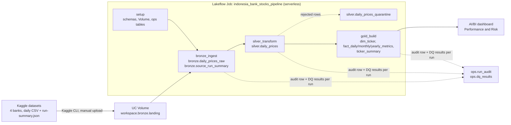

# Architecture

> How the pipeline is built and why. Table-level detail: `docs/DATA_MODEL.md`. Decisions: `docs/DECISIONS.md`. Operations: `docs/RUNBOOK.md`.

## Data flow

## Layer responsibilities

| Layer | Tables | Responsibility |
| ----- | ------ | -------------- |
| Landing | Volume `workspace.bronze.landing/<folder>/` | The 4 daily CSVs and 4 `run-summary.json`, exactly as downloaded (8 files) |
| Bronze | `daily_prices_raw`, `source_run_summary` | Every source row as STRING (no value lost), plus the ticker from the folder, `source_file`, load time and pipeline run ID; the source's own run summary kept for reconciliation |
| Silver | `daily_prices`, `daily_prices_quarantine` | Explicit types via `try_cast`; invalid rows quarantined with a reason code; `volume_status` flag (normal / zero_all_tickers / zero_partial); duplicate keys stop the run |
| Gold | `dim_ticker`, `fact_daily_metrics`, `fact_monthly_metrics`, `fact_yearly_metrics`, `ticker_summary` | KPIs K1–K11 exactly as defined in `docs/KPI_DEFINITIONS.md`, one grain per table, lineage columns on every table; the only source for the dashboard |
| ops | `run_audit`, `dq_results` | Append-only run log (start, end, status, rows in/out/rejected, error) and every data-quality check result per run |

## Job DAG and parameters

`setup` → `bronze_ingest` → `silver_transform` → `gold_build` (definition: `jobs/indonesia_bank_stocks_pipeline.job.yml`).

| Parameter | Default | Purpose |
| --------- | ------- | ------- |
| `catalog` | `workspace` | Target catalog; validated as an identifier before use |
| `landing_path` | `/Volumes/workspace/bronze/landing` | Source folder; the failure test points it at a fixture folder |
| `pipeline_run_id` | `{{job.run_id}}` | One ID shared by all tasks, the audit rows, the DQ results and the Gold lineage |
| `job_run_id` | `{{job.run_id}}` | Stored in `ops.run_audit` |

Each task runs its layer's data-quality checks **before** writing. A failed CRITICAL check raises, so the task writes nothing and the downstream tasks
are skipped. Every task appends an audit row on success and on failure. The notebook parameters override `config/pipeline.json`, the single
configuration source.

## Design choices (one line each; details in `docs/DECISIONS.md`)

- **Batch, full refresh** (DEC-04, DEC-06): the source re-publishes its whole history, so a deterministic overwrite is both the simplest and the
  correct approach; reruns are idempotent (`docs/evidence/d2-07-rerun.md`).
- **Notebooks + Jobs + hand-written checks** (DEC-05): direct control over audit rows, quarantine and blocking, without the extra abstraction of a
  declarative pipeline.
- **Logic in `src/bank_pipeline/`, notebooks only orchestrate:** the same functions are unit-tested (`tests/`).
- **STRING Bronze, `try_cast` Silver:** no source value is lost; bad values become a quarantine reason instead of a failed cast.
- **Duplicates stop, invalid rows quarantine:** a duplicated key means a broken snapshot (stop); a malformed row is an isolated problem (quarantine).
- **Gold = one grain per table** (DEC-08): thin dashboard queries and one place per KPI.
- **`adjclose` total-return basis** (DEC-03): comparable across banks with different dividend policies.
- **Retries disabled:** data-quality failures are deterministic, so a retry only costs compute; transient errors use Repair run (`docs/RUNBOOK.md`).
- **Serverless, no secrets** (DEC-07): Free Edition offers serverless compute only, and the pipeline reads Volume files without credentials.

## Technology

Databricks Free Edition (serverless compute), Unity Catalog (catalog, schemas, Volumes), Delta tables, PySpark and Spark SQL, Lakeflow Jobs,
AI/BI dashboards, Git folders. Local tooling: Python 3 for the plain-Python tests; the Kaggle CLI for downloading the source data.
