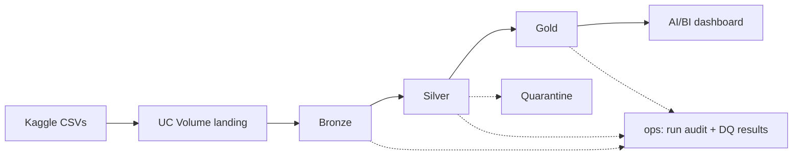
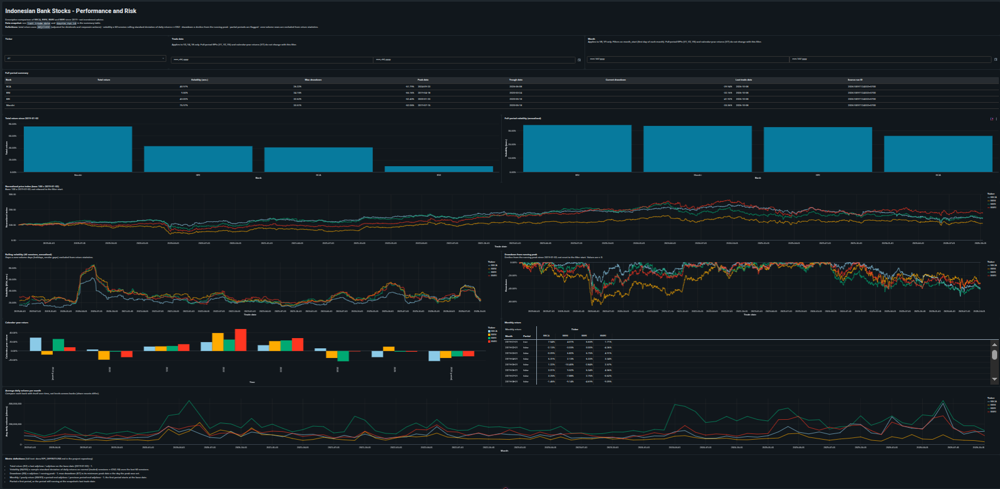
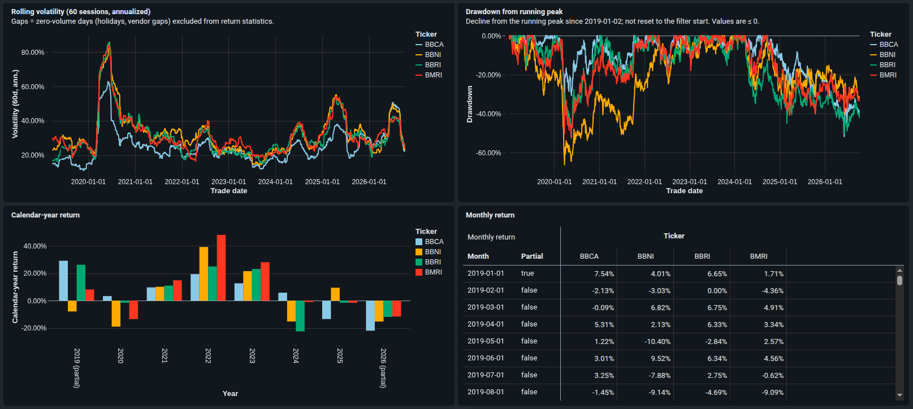

# Final Report: Indonesian Banking Stock Performance Analytics on Databricks

> Snapshot analysed: daily prices of BBCA, BBNI, BMRI and BBRI from the base date **2019-01-02** to the last trade date **2026-10-08** (source run
> `20261009T124332+0700`). Every number cites an evidence file in `docs/evidence/`. Pipeline runs were executed by the project owner in Databricks
> and recorded there (owner-reported). Technical evidence (§4–§7, §9) is kept separate from business findings (§8). The findings are **descriptive
> observations on one historical snapshot: no investment advice, no forecasts, no causal claims.**

## 1. Executive summary and business problem

**Stakeholder:** an individual investment analyst who wants a descriptive, like-for-like comparison of four large Indonesian bank stocks (DEC-02 in
`docs/DECISIONS.md`).
**Problem:** raw price files from a third-party source cannot be compared directly. They need consistent total-return pricing, explicit treatment of
non-trading days, and trustworthy, reproducible KPIs.

**What was built:** a batch Bronze → Silver → Gold pipeline on Databricks Free Edition, orchestrated as a four-task Lakeflow Job, with data-quality checks
in every layer, a run audit and an AI/BI dashboard. The pipeline:
- reruns idempotently (`docs/evidence/d2-07-rerun.md`);
- stops on bad data without publishing partial results (`docs/evidence/d2-09-failure-test.md`);
- rebuilds everything from the landed files (`docs/evidence/d3-04-clean-state.md`);
- serves dashboard values that match independent queries 14/14 (`docs/evidence/d3-03-dashboard-reconciliation.md`).

**Headline findings** (§8): over the snapshot, BMRI had the highest total return (75.97%) and BBNI the lowest (9.50%). BBCA was the least volatile
(26.22% annualized). BBNI had the deepest decline from a peak (−66.16%).

## 2. Dataset

Source and profile: `docs/DATASET.md`.

- **Sources:** four public Kaggle datasets by `caesarmario` (one per bank). The publisher states they are taken from Yahoo Finance and refreshed daily as a
  full re-extraction of the history.
- **Structure:** per bank, 10 files: daily, weekly and monthly OHLCV bars in CSV and Parquet, plus 4 JSON run-metadata files. Every price file has the same 8
  columns: `Date, open, high, low, close, adjclose, volume, ingested_at_utc`. The ticker appears only in file names and metadata.
- **Size:** 40 files, 1,335,232 bytes; 1,887 daily rows per bank. All four banks share exactly the same 1,887 dates (2019-01-01 → 2026-10-08).
  CSV and Parquet are equal cell by cell. The pipeline uses the **4 daily CSVs** plus the **4 `run-summary.json`** files (DEC-05).
- **Licence:** the Kaggle licence label is `world-bank`; the upstream Yahoo Finance terms were not verified, so **raw data is not redistributed** in the
  repository.
- **Limitations seen in profiling:**
  - prices are back-adjusted, and no as-traded price exists;
  - `adjclose` is rewritten on every refresh;
  - float32 precision;
  - the source weekly and monthly files carry date-label offsets, so the pipeline derives periods from daily data instead;
  - 13 dates on which all four banks show zero volume (likely exchange holidays; inferred, not checked against the IDX calendar) appear as flat rows, all in 2019; after mid-2019 such dates are absent from the data;
  - there are ticker-specific vendor gaps on 2020-03-13 and 2020-03-16.

## 3. Business questions and KPI definitions

Full definitions: `docs/KPI_DEFINITIONS.md` (DEC-03, DEC-14).

| Question | KPIs (Gold table) |
| -------- | ----------------- |
| Q1 Highest total return and performance path | K2 total return = last `adjclose` / base-date `adjclose` − 1 (`ticker_summary`); K1 normalized index = 100 × `adjclose` / base-date `adjclose` (`fact_daily_metrics`) |
| Q2 Volatility and how it changed | K3 daily simple return on traded ("normal") sessions; K4 60-session rolling volatility = sample std. dev. × √252; K5 full-period volatility |
| Q3 Deepest decline and current position | K6 drawdown = `adjclose` / running peak − 1; K7 max drawdown, the peak date (the day the peak was set) and trough date, current drawdown |
| Q4 Monthly and yearly returns | K8 / K9 period-end `adjclose` / previous period-end `adjclose` − 1, with an `is_partial` flag (`fact_monthly_metrics`, `fact_yearly_metrics`) |
| Q5 Volume vs each bank's normal level | K10 relative volume (vs the previous 60 sessions); K11 average daily volume per month |

**Global rules:**
- `adjclose` (total return) basis.
- Base date = first day on which all four banks traded (2019-01-02).
- Zero-volume rows are flagged (`zero_all_tickers` / `zero_partial`) and get NULL return statistics instead of an artificial 0%. They are never deleted.

## 4. Architecture and technology choices

Diagram and layer details: `docs/ARCHITECTURE.md`. Rationale for each choice: `docs/DECISIONS.md`.

| Choice | Rationale (decision) |
| ------ | -------------------- |
| Databricks Free Edition, serverless, Unity Catalog, Delta | The available platform; capabilities verified before use (DEC-07, `docs/evidence/d1-02-workspace-capabilities.md`) |
| Batch, full refresh | The source republishes its whole history, so a deterministic overwrite is the simplest correct option and is idempotent (DEC-04, DEC-06) |
| Notebooks + Lakeflow Jobs + hand-written DQ checks | Direct control of audit rows, quarantine and blocking without the extra abstraction of a declarative pipeline (DEC-05) |
| Logic in a Python package (`src/bank_pipeline/`) | Notebooks only orchestrate; the functions are unit-tested (DEC-10) |
| Gold = one grain per table | Thin dashboard queries; each KPI defined in exactly one place (DEC-08) |
| Public repo + Git folder | No credentials in the workspace; reproducible from the repository (DEC-09, DEC-12) |

## 5. Bronze, Silver and Gold transformations

Table and column detail: `docs/DATA_MODEL.md`.

- **Bronze** (`daily_prices_raw`, `source_run_summary`): every CSV row is loaded with all 8 columns as **STRING**, so no source value is lost. The task adds
  the ticker (from the landing folder), `source_file`, the load timestamp and the pipeline run ID; values that do not fit the schema go to
  `_rescued_data`. The source's own run summary is kept for reconciliation.
- **Silver** (`daily_prices`, `daily_prices_quarantine`):
  - explicit types via `try_cast` (serverless runs in ANSI mode, so a bad value must not crash the task);
  - six reject reasons (invalid date, invalid price, non-positive price, invalid volume, OHLC inconsistency, rescued data) send a row to quarantine
    with its original strings;
  - a duplicated (ticker, date) key stops the run instead of being quarantined;
  - `volume_status` is derived per date across all four banks.
- **Gold** (`dim_ticker`, `fact_daily_metrics`, `fact_monthly_metrics`, `fact_yearly_metrics`, `ticker_summary`):
  - K3/K4/K10 are computed on traded rows only and joined back;
  - drawdown uses all rows (flat rows carry the previous price);
  - monthly and yearly returns are derived from daily data, not from the offset source files;
  - every table carries lineage (source run ID, source ingestion time, pipeline run ID, build time);
  - the Gold checks run on the computed DataFrames before any table is overwritten.

## 6. Data-quality rules and validation results

Full catalog: `docs/DQ_CATALOG.md`. There are 30 checks: Bronze 6, Silver 14, Gold 10. CRITICAL checks block the write; WARN and INFO checks are recorded only.

| Layer | Recorded results on normal data | Evidence |
| ----- | ------------------------------- | -------- |
| Bronze | 6/6 passed; 4 × 1,887 rows = the source's stated daily rows; 0 rescued rows | `d2-01-bronze.md`, `d2-06-job.md` |
| Silver | All CRITICAL passed; **quarantine 0 rows**; 7,548 rows = 7,548 distinct keys; `zero_all_tickers` 52 rows: 13 dates on which all four banks show zero volume (likely exchange holidays; inferred, not checked against the IDX calendar), × 4 banks; **WARN `silver_zero_partial_count` = 4** (BBCA 2020-03-13 and 2020-03-16, BBNI 2020-03-13, BMRI 2020-03-16, all flat at the previous close); base date 2019-01-02 | `d2-03-silver.md`, `d2-06-job.md` |
| Gold | 10/10 passed; 7,544 daily rows = Silver rows from the base date; 60 leading NULL volatility rows per ticker; 16 partial periods; after DEC-14, every peak date is a normal trading day | `d2-05-gold.md` |
| Clean state | Identical counts and volume-status counts after rebuilding from empty tables | `d3-04-clean-state.md` |

**Flag, don't delete.** The 4 vendor-gap rows and the 52 all-ticker zero-volume rows stay in Silver and Gold with their flag. They are excluded from return statistics,
which explains the visible gaps in the rolling-volatility chart (R-D6: NULL volatility after the warm-up occurs only on flagged rows;
`d3-03-dashboard-reconciliation.md`).

## 7. Orchestration, reliability and processing strategy

- **Job** `indonesia_bank_stocks_pipeline`: `setup → bronze_ingest → silver_transform → gold_build` on serverless compute (`jobs/`, `docs/ARCHITECTURE.md`).
  - Parameters: `catalog`, `landing_path` and `pipeline_run_id` = `job_run_id` = `{{job.run_id}}`. One ID links the audit rows, DQ results and Gold
    lineage (`d2-06-job.md`).
- **Automatic retries disabled.** A failed CRITICAL check fails again on retry, so a retry only spends compute and delays the failure email. Transient
  errors are handled with Repair run (`docs/RUNBOOK.md`).
- **Processing strategy:** batch with full refresh (DEC-04, DEC-06). Each task checks before it writes, and every task writes an audit row on success and
  on failure.
- **Rerun test:** Job runs 1066568616292788 and 371194405323795 on the same input; Delta versions 2 vs 3 of all 9 tables are identical
  (doubles within 1e-9) → **RERUN CHECK PASS 9/9** (`d2-07-rerun.md`).
- **Induced failure and recovery:** a fixture replaced one BBCA row with a copy of the previous row (DEC-13).
  - Failing run 164942117421206: Bronze succeeded; Silver **stopped** on `silver_no_duplicate_keys`; Gold was **skipped**; the failure email arrived;
    Silver and Gold kept the last good run.
  - Recovery run 318690159636842 (a new full run): restored Bronze, with identical KPIs (`d2-09-failure-test.md`).
  - An unplanned misconfiguration (a path typed into the `catalog` parameter) was rejected in `setup` before any SQL ran.
- **Clean-state run:** all 11 tables dropped, then Job run 994907076175214 rebuilt everything with identical results (`d3-04-clean-state.md`).
- **Runtimes:** 3m38s–3m50s per full run (3m50s: the warm-up run 715316575128346 before the demo rehearsal); 5m41s after about 9.5 h idle (likely
  a serverless cold start, not verified); 1m45s for the failing run (`d2-06-job.md`, `d2-07-rerun.md`, `d2-09-failure-test.md`,
  `d3-07-demo-rehearsal.md`).

## 8. Dashboard overview and key findings

"Indonesian Bank Stocks - Performance and Risk" is a one-page AI/BI dashboard over four Gold-only datasets. It has nine visuals (summary table, total
return, normalized index, rolling volatility, full-period volatility, drawdown, yearly returns, monthly-return pivot, average daily volume) and filters for
ticker, trade date and month (`docs/evidence/d3-01-dashboard.md`, `dashboards/DASHBOARD_SPEC.md`). Every headline value was reconciled with independent
Silver queries: 14/14 match (`d3-03-dashboard-reconciliation.md`).

**Findings.** All are historical observations on this snapshot (base 2019-01-02 → 2026-10-08). The values come from `d2-05-gold.md` and
`d3-03-dashboard-reconciliation.md`.

| Bank | Total return | Volatility (ann.) | Max drawdown (peak → trough) | Current drawdown |
| ---- | -----------: | ----------------: | ---------------------------- | ---------------: |
| BMRI | 75.97% | 33.51% | −52.05% (2019-07-15 → 2020-05-18) | −33.36% |
| BBRI | 43.02% | 32.62% | −52.43% (2020-01-23 → 2020-05-18) | −41.92% |
| BBCA | 40.97% | 26.22% | −51.79% (2024-09-23 → 2026-06-08) | −39.94% |
| BBNI | 9.50% | 34.15% | −66.16% (2019-04-18 → 2020-03-24) | −32.16% |

1. **Total return ranking:** BMRI (75.97%) > BBRI (43.02%) > BBCA (40.97%) > BBNI (9.50%).
2. **Volatility:** BBCA had the lowest full-period volatility (26.22%); the other three were close together, between 32.62% and 34.15%.
3. **Drawdowns:** BBNI had the deepest decline from a peak (−66.16%, from 2019-04-18 to 2020-03-24). BBRI's and BMRI's deepest declines both bottomed
   on 2020-05-18. BBCA's deepest decline is the **recent** episode from 2024-09-23 to 2026-06-08, not 2020.
4. **Position at the end of the snapshot:** all four were between 32% and 42% below their running peaks (current drawdown −32.16% to −41.92%).
5. **Selected calendar-year returns:**
   - BBCA: 19.38% in 2022 and −13.40% in 2025; −21.89% in 2026 to date (a partial year);
   - BBNI: 39.19% in 2022.
   - (Years not listed were not captured in the recorded evidence.)
6. **The price basis matters.** From the profiled `close` values in `docs/DATASET.md` §5, the price change from 2019-01-01 to 2026-10-08 is
   BBCA +15.4%, BBNI −22.5%, BBRI −8.9%, BMRI +8.5%. *(This is computed from the profiled close values and is not a pipeline KPI; its start date is
   2019-01-01.)* With dividends included (`adjclose`, total return), all four are positive and the ranking differs. The choice of basis changes the
   comparison, which is why the project uses total return.
7. **Volatility over time:** the rolling volatility of all four rose sharply in early 2020 (V4, screenshot 04). This is a visual observation; no
   cause is attributed.
8. **Volume (Q5):** average daily volume per month is shown in V9, where each bank is compared with itself over time. No quantitative volume
   finding is reported, because no volume values were recorded in the evidence.

## 9. Testing results and known limitations

Summary of `docs/TEST_RESULTS.md`:

| Concern | Result |
| ------- | ------ |
| Code correctness | Plain-Python tests 17/17 (local); Spark unit tests 42/42 in Databricks (`d2-08-unit-tests.md`); configuration and secrets review clean (`d2-10-config-review.md`) |
| Data quality | 30 checks in 3 layers; results above (§6) |
| Pipeline execution | End-to-end run, rerun 9/9 identical, induced failure contained and recovered, clean-state rebuild identical |
| Business-metric correctness | Silver vs Gold total return abs_diff 0; 14/14 dashboard values match independent queries; for **BBCA and BBNI** (the two tickers whose yearly rows were all recorded), the yearly returns compound to total return within 3e-16 (agent check, `d2-05-gold.md`); the Gold check `gold_monthly_compounds_to_yearly` (monthly returns compound to the yearly return within 1e-9, every ticker-year of all four tickers) passed in every run whose Gold check results were recorded (`d2-05-gold.md`, `d2-06-job.md`, `d3-04-clean-state.md`) |

**Main limitations** (full list: `docs/LIMITATIONS.md`):
- no as-traded prices, and the vendor's adjustments are inferred;
- one snapshot without history, since `adjclose` is rewritten on refresh;
- √252 annualization convention;
- volume possibly not adjusted for corporate actions (not checked);
- vendor gaps flagged, not repaired;
- the dashboard KPIs are full-period values (no window KPIs);
- Free Edition limits (serverless only, quotas, no SLA);
- Gold writes are atomic per table, not across tables;
- a single environment;
- the upstream licence is unverified.

## 10. Setup, reproduction and future improvements

**Setup and reproduction:** `README.md` ("Reproduce it"): download with the Kaggle CLI → Git folder → `00_setup` → upload 8 files → smoke test → create and
run the Job → build or import the dashboard → run the `sql/validation` queries. Operations, failure recovery and the clean-state procedure:
`docs/RUNBOOK.md`.

**Future improvements:**
- **Window KPIs** (return, volatility, drawdown over a dashboard date range) via a Unity Catalog SQL table function in Gold, so the logic stays in one
  place.
- **Snapshot history** instead of overwrite (one partition or table version per source run), to compare how adjusted history changes between refreshes.
- **Deployment as code** with Databricks Asset Bundles instead of recreating the Job by hand.
- **CI** running `python tests/test_pure.py` on every push.
- **Scheduled refresh** of the Job and dashboard subscriptions.
- **Verification of corporate actions and volume adjustment** against an official source (for example the BBNI and BMRI adjustment dates).
- **Alerting on WARN trends** (for example new `zero_partial` rows or quarantine growth) from `ops.dq_results`.
- **A Genie space** on the Gold tables for natural-language questions.
